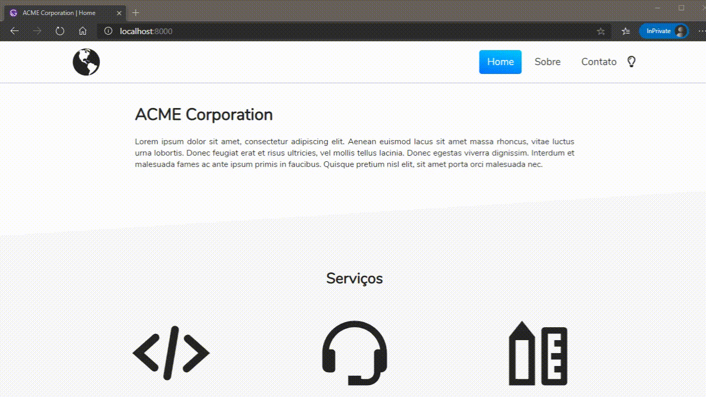

# institutional-website-gatsby

Exemplo de site institucional feito com ReactJS + GatsbyJS

[Live demo](https://condescending-mccarthy-1d6dd7.netlify.app/)

### Comandos

Instalar as dependências:

```bash
yarn
```

Rodar em modo de desenvolvimento:

```bash
yarn develop
```

Fazer o build e rodar localmente:

```bash
yarn build
yarn serve
```

### Demonstrações

Home page:



Dark theme:


